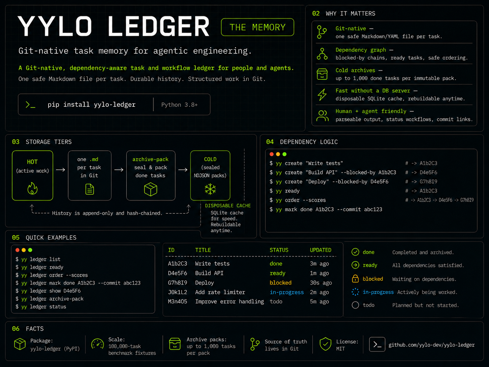

# YYLO Ledger — Git-Native Task Management

YYLO Ledger is a Git-native, shell-friendly task manager for developers and LLM workflows. Canonical current state is one safe Markdown/YAML file per task; history is a separate append-only ledger and SQLite is disposable.

<p align="center">
  
</p>

<p align="center">
  
</p>

[](https://pypi.org/project/yylo-ledger/)
[](https://python.org)
[](LICENSE)
[](#shell-integration)
[](#jq-integration)

## Quick Start

```bash
# Install in development mode
pip install -e .

# Create your first task
yylo-ledger create "Implement user authentication" --tags backend security

# Optional title + body composition
yylo-ledger create --title "Auth" --body "Implement OAuth callback handling"

# List recent tasks
yylo-ledger list --limit 5
yylo-ledger list --status backlog,in_progress --sort asc   # preserve explicit status order

# Search and filter
yylo-ledger search --status todo --tags backend
yylo-ledger search --status todo --format json             # command-level --format is supported

# Aggregate tag usage (optionally by workflow status)
yylo-ledger tags --status todo,in_progress --format table

# Mark task progress with response (ID can be positional or flag)
yylo-ledger mark in_progress ABC123 --response "Started OAuth integration"

# Complete with commit hash
yylo-ledger mark done --id ABC123 --response "Auth completed" --commit abc123def

# Declare dependencies between tasks
yylo-ledger create "Deploy to staging" --blocked-by ABC123

# Find tasks ready to work on (all blockers resolved)
yylo-ledger ready
yylo-ledger ready --sort asc   # oldest ready tasks first by last_modified
# ready now includes list-like summary counters (Displayed/Total + status breakdown)

# Get safe execution order respecting dependencies
yylo-ledger order --scores
```

## Immutable cold archive packs

Boards can explicitly move up to 1,000 old terminal tasks at a time from hot Markdown/ledger files into bounded, immutable NDJSON packs. Default `list`, `search`, `ready`, and `order` remain hot-only; exact `get ID` and `history ID` transparently verify and read either tier. Existing `archive ID` still only changes status.

Archival is never automatic. With owner authorization, a clean Git worktree/index, and durable new report paths outside the repository:

```bash
yylo-ledger archive-pack plan --status done,archive --older-than 90d --max-tasks 1000 \
  --target-bytes 26214400 --hard-max-bytes 47185920 \
  --report /external/receipts/archive-plan.json
# Independently review source HEAD, config/policy hashes, selected IDs/revisions, and batches.
yylo-ledger archive-pack create --plan /external/receipts/archive-plan.json \
  --report /external/receipts/archive-create.json
yylo-ledger archive-pack doctor
yylo-ledger doctor
yylo-ledger archive-search --tag backend --before 2026-01-01 --limit 20 --projection metadata
```

Plans are revision-bound and fail closed when Git/config/reservations/archive inventory or selected task history changes. Sealed packs/manifests must never be edited or appended. Archived IDs stay terminal and globally reserved; create a new hot task related to the archived ID for follow-up work. Production archival, push/deploy, and post-deploy E2E require separate authorization. Receipts contain hashes/IDs/instructions, not duplicated task bodies or responses.

Scale evidence is generated only through the installed public commands:

```bash
python3 scripts/benchmark_cold_archive.py --tasks 10000 --report evidence/cold-archive-10k.json
python3 scripts/benchmark_cold_archive.py --tasks 100000 --report evidence/cold-archive-100k.json
python3 scripts/verify_wheel_install.py
```

## Opt-in cross-project registry

Cross-project access is disabled by default. Enable only the aliases that the current source project may reach in `.juno_task/config.json`:

```json
{
  "kanbanRegistry": {
    "enabled": true,
    "allowedProjects": ["juno-code", "convert-if-chat"]
  }
}
```

Register initialized local projects in the single user registry (`~/.yylo-ledger/projects.json`) and route any read or write explicitly:

```bash
yylo-ledger project add juno-code --path /absolute/path/to/juno-code
yylo-ledger project list
yylo-ledger --project juno-code create --body "Issue discovered elsewhere" --tags bug
yylo-ledger --project juno-code list --status todo
yylo-ledger project remove juno-code
```

Environment policy has precedence over project config:

```bash
export YYLO_LEDGER_REGISTRY_ENABLED=true
export YYLO_LEDGER_REGISTRY_ALLOWED_PROJECTS=juno-code,convert-if-chat
```

Enabling without an allowlist grants access to nothing. Routing executes the destination project's `.juno_task/scripts/kanban.sh`, so its controller, `.venv_juno`, compatibility checks, stdin rules, and write guards remain authoritative. Missing, stale, malformed, disallowed, or recursive routes fail without falling back to the source board. This backing destination-wrapper boundary matters because selecting a foreign storage path with the caller runtime could bypass project-specific safety. Two-project subprocess tests verify the implementation preserves exact stdin and reaches only the selected target.

## Installation

### PyPI (Recommended)

```bash
pip install yylo-ledger
```

The canonical distribution, command, and import are `yylo-ledger`, `yylo-ledger`,
and `yylo_ledger`. During the bounded 0.1 RC migration window, the six former
console scripts (`juno-ledger`, `ledger-juno`, `jl`, `juno-kanban`,
`juno-feedback`, and `kanban-juno`) emit a deprecation action and delegate to
the same runtime; the deprecated `kanban` import is a single-runtime bridge.

### Development Mode

```bash
git clone https://github.com/yylo-dev/yylo-ledger.git
cd yylo-ledger
pip install -e .
```

### Requirements

- Python 3.8+
- Runtime dependency `ruamel.yaml>=0.18.6,<0.19` is installed automatically
  for safe round-trip YAML that preserves comments and ordering

## Native Record CLI (v2)

The ID-first `record`, `task`, `wiki`, `workflow`, and `artifact` groups expose
`create`, `list`, `search`, `get`, `update`, `history`, and `archive` where the
profile permits mutation. There is intentionally no Record `remove` command.
Flat task commands remain the explicit legacy v1 compatibility surface. They
retain existing semantics for the full 0.x line, emit no per-command deprecation
warning, and may change only at a documented major-version boundary.

```bash
yylo-ledger wiki create --title Guide --file guide.md
yylo-ledger wiki get RECORD_ID --raw
yylo-ledger wiki get RECORD_ID --front-matter
yylo-ledger workflow create --title Build --file workflow.yaml
yylo-ledger workflow get RECORD_ID --validated
yylo-ledger artifact create --title Report --profile report --mode local --file report.bin
yylo-ledger record search --scope all --profile wiki --limit 20 -f json
```

Slug and retained-alias inputs resolve once; structured results report the
immutable `id`, current `slug`, and `resolved_from` for non-ID input. Updates
are compare-and-replace operations: provide `--expected-revision` and exact
`--old-file/--new-file`, or `--path --expect-file --value-file`. Wiki
front-matter import additionally requires the SHA-256 `--expected-preimage` of
the complete prior export. Rich Markdown, YAML, and binary artifacts use file
or `-`/`--stdin` transport rather than inline shell arguments.

Record search is bounded to 100 records and 1 MiB of rendered JSON by default;
`--max-output-bytes` can only lower the per-command budget. Use explicit
`--scope hot|archive|all`, stable cursors, and `metadata|summary|full`
projections. Summary search omits body/payload bytes, sensitive Records expose
only safe identity metadata, and credential/email-like values are redacted
before JSON, NDJSON, XML, or table rendering.

## Shell Completion (Tab Autocomplete)

`yylo-ledger` ships a native completion script generator for every command alias:

```bash
# One-time test in current shell
source <(yylo-ledger completion bash)

# Persist for bash
echo 'source <(yylo-ledger completion bash)' >> ~/.bashrc

# Persist for zsh
echo 'source <(yylo-ledger completion zsh)' >> ~/.zshrc

# Fish
yylo-ledger completion fish > ~/.config/fish/completions/yylo-ledger.fish
```

After reloading your shell, `yylo-ledger c<TAB><TAB>` suggests commands like `create`/`completion`,
and command-specific flags/choice values are also suggested (e.g. `list --sort <TAB>`).

## Core Features

### 🗂️ **Git-Native Storage**
- Stable `.juno_task/tasks/<prefix>/<ID>.md` files with safe round-trip YAML and hidden Markdown boundaries
- Per-task locks/CAS receipts and segmented, hash-chained ledgers under `.juno_task/ledger/`
- Different-task worktree changes merge independently; status updates never rename files

### 🔍 **Disposable Cached Search**
- Rebuildable `.juno_task/cache/kanban.sqlite3` index; canonical Markdown remains authoritative
- Core/tag/body filters plus typed custom fields, date ranges, and `--overdue`
- Bounded/redacted broad output with explicit `metadata`, `summary`, and audited `full` projections

### 🏷️ **Flexible Organization**
- Configurable status workflows (backlog → todo → done)
- Feature tags for categorization
- `tags` command for per-tag workload counts (supports status filtering + machine-readable formats)
- Commit hash linking for git integration

### 🔗 **Task Dependencies**
- Declare blockers with `--blocked-by` or body markup (`[blocked_by]ID[/blocked_by]`)
- Declare non-blocking related references with `[task_id]...[/task_id]` or `## ID1 ID2 ##`
- Cycle detection prevents circular dependencies
- `ready` command finds unblocked tasks for parallel execution
- `order` command returns topological sort for safe scheduling
- Priority scoring ranks tasks by how much downstream work they unblock
- Every generic mutation to `done` is refused before any task/ledger write when a declared blocker is missing or non-terminal; reopening a resolved blocker is likewise refused when it would block a completed dependent
- Umbrella child reconciliation is available only through `umbrella-finalize`. Its sealed `umbrella-admission` receipt must bind the umbrella revision and every child revision and state `task_id`, `owner_id` (the umbrella ID), and `admitted: true` per child. Admitted IDs must exactly equal `blocked_by`; `related_tasks` are never closed. A sealed evidence receipt bound to that umbrella ID and commit is required. Activation updates all task/ledger pairs in one recoverable transaction, and replay emits no additional events

```bash
yylo-ledger umbrella-finalize UMB123 \
  --admission-receipt /external/admission.json \
  --evidence-receipt /external/evidence.json --commit abc123 \
  --receipt-file /external/finalization.json
```

### 🤖 **LLM & Shell Optimized**
- jq-compatible output for automation
- Educational error messages with examples
- Context-aware help text
- Flexible task ID input (`TASK_ID` positional or `--id/--ID` on key commands)
- Agent-friendly create/deps parsing (`--title`, flag-only `deps --id ... --blocked-by ...`, trailing quoted body recovery)
- Clean, parseable formats

Operational conversion, rollback, reconciliation, cache, safety, test, and benchmark contracts are documented in [`docs/git-native-storage.md`](docs/git-native-storage.md).

## Usage Guide

### Creating Tasks

```bash
# Basic task creation
yylo-ledger create "Fix authentication bug"

# With tags and status
yylo-ledger create "Add user profile page" --status todo --tags frontend ui

# Using --body flag (both formats work)
yylo-ledger create --body "Implement OAuth" --tags security backend

# Optional title merged into body as: title:{title}\n\n{body}
yylo-ledger create --title "OAuth" --body "Implement provider callback validation"

# Read shell-sensitive markdown exactly from a UTF-8 file or stdin
yylo-ledger create --body-file task.md --status todo --tags feature backend
cat task.md | yylo-ledger create --body-file -

# Why file/stdin matters: shells expand unquoted backticks and $() before
# YYLO Ledger can inspect argv. For quoted literals that survive parsing,
# create rejects inline backticks, $(), heredoc-like <<, and multiline bodies
# and asks you to use --body-file PATH or --body-file - instead.

# Trailing quoted body after list flags is supported
yylo-ledger create --status todo --related-tasks ABC123 "Add integration tests for callback flow"
```

### Searching & Listing

```bash
# List recent tasks (sorted by last modified)
yylo-ledger list --limit 10

# Search by status
yylo-ledger search --status in_progress

# Search by tags
yylo-ledger search --tags backend --tags security

# Aggregate tag counts across all tasks
yylo-ledger tags

# Aggregate tag counts only for active work
yylo-ledger tags --status todo,in_progress --format json
yylo-ledger tags --status todo in_progress --format table

# Search open tasks (no agent response)
yylo-ledger search --open

# Search recent tasks
yylo-ledger search --recent --limit 5

# Control search sort order by last_modified
yylo-ledger search --status todo --sort asc --limit 5

# Multiple conditions (AND logic)
yylo-ledger search --status todo --tags backend --limit 3
```

`--sort asc|desc` uses one shared contract across `list`, `search`, and `ready`:
- `asc` = oldest `last_modified` first
- `desc` = newest `last_modified` first
- equal timestamps use task `id` as deterministic tie-breaker
- default `list` behavior preserves open-before-closed status priority (`backlog/todo/in_progress` before `done/archive`)
- when `list` or `ready` receives `--status ...`, task groups follow the provided status order, then `--sort` applies within each status group

### Updating Tasks

```bash
# Update status (positional or --id both supported)
yylo-ledger update ABC123 --status in_progress
yylo-ledger update --id ABC123 --status in_progress

# Add agent response
yylo-ledger update --id ABC123 --response "Working on OAuth flow"

# Replace body/response from files without shell quoting risks
yylo-ledger update ABC123 --body-file task.md
yylo-ledger update ABC123 --response-file response.md

# Set commit hash
yylo-ledger update --id ABC123 --commit abc123def

# Update tags
yylo-ledger update ABC123 --tags urgent backend security
```

### Mark Command (Streamlined Workflow)

```bash
# Mark with required response
yylo-ledger mark todo ABC123 --response "Ready to start"

# Mark as done with commit (recommended)
yylo-ledger mark done --id ABC123 --response "Feature completed" --commit abc123

# Read response from a file or stdin, preserving code fences/backticks/$VARIABLES
yylo-ledger mark done --id ABC123 --response-file response.md --commit abc123
cat response.md | yylo-ledger mark done --id ABC123 --response-file -

# Mark without commit (shows helpful reminder)
yylo-ledger mark done ABC123 --response "Bug fixed"
# Output: Consider adding commit hash with --commit flag
```

### Dependency Management

```bash
# Create a task that's blocked by another
yylo-ledger create "Deploy to prod" --blocked-by ABC123

# Or declare blockers via body markup (auto-parsed)
yylo-ledger create "Run integration tests [blocked_by]ABC123, DEF456[/blocked_by]"

# Add/remove dependencies after creation
yylo-ledger deps add --id GHI789 --blocked-by ABC123 DEF456
yylo-ledger deps remove --id GHI789 --blocked-by ABC123

# Shorthand add (action inferred when --blocked-by is present)
yylo-ledger deps --id GHI789 --blocked-by ABC123 DEF456

# Query dependency info for a task
yylo-ledger deps ABC123
yylo-ledger deps --id ABC123
# Returns: blockers (met/unmet), dependents, priority score

# Find tasks ready to work on (all blockers resolved)
yylo-ledger ready
yylo-ledger ready --sort asc --limit 5                         # oldest ready tasks first
yylo-ledger ready --status backlog,in_progress --sort desc     # backlog group first, then in_progress
yylo-ledger ready --tag backend --sort desc                    # newest backend-ready tasks first

# Get safe execution order (topological sort)
yylo-ledger order
yylo-ledger order --scores  # includes priority scores
```

#### Body Markup for Dependencies

Dependencies and related tasks can be declared inline in the task body:

```bash
# Blockers (all synonyms are equivalent)
[blocked_by]ABC123[/blocked_by]
[block_by]ABC123[/block_by]
[block]ABC123[/block]
[parent_task]ABC123[/parent_task]

# Multiple blockers (comma or space separated)
[blocked_by]ABC123, DEF456[/blocked_by]

# Related tasks (non-blocking references)
[task_id]ABC123[/task_id]
## ABC123
##ABC123
## ABC123 DEF456 ##

# If a related ID is valid format but not found yet, it is kept as a
# forward reference and a warning is emitted.
```

### Other Operations

```bash
# Get specific task(s) (includes dependency info)
yylo-ledger get ABC123
yylo-ledger get --id ABC123
yylo-ledger get ABC123 --compact              # related task details are ID-only
yylo-ledger get ABC123 DEF456 --format json   # ordered multi-ID lookup
yylo-ledger show ABC123 DEF456 --format json  # alias

# Archive task (preserves data, sets status to archive)
yylo-ledger archive ABC123
yylo-ledger archive --id ABC123

# Preview one sealed merge plan, review it, then apply that exact plan.
yylo-ledger merge /path/to/source/.juno_task --into ./.juno_task \
  --dry-run --plan-file /tmp/kanban-merge-plan.json
yylo-ledger merge /path/to/source/.juno_task --into ./.juno_task \
  --apply-plan /tmp/kanban-merge-plan.json \
  --receipt-file /tmp/kanban-merge-receipt.json

# Show help
yylo-ledger --help
yylo-ledger COMMAND --help
```

## Output Formats

### NDJSON (Default)
```bash
yylo-ledger search --status todo
```
```json
{"id": "ABC123", "status": "todo", "body": "Fix bug", "tags": ["backend"]}
{"id": "DEF456", "status": "todo", "body": "Add feature", "tags": ["frontend"]}
```

### JSON (Structured)
```bash
yylo-ledger search --status todo --format json
# also supported: yylo-ledger --format json search --status todo
```
```json
[
  {"id": "ABC123", "status": "todo", "body": "Fix bug", "tags": ["backend"]},
  {"id": "DEF456", "status": "todo", "body": "Add feature", "tags": ["frontend"]}
]
```

### XML
```bash
yylo-ledger search --status todo --format xml
```

### Table (Human-readable)
```bash
yylo-ledger search --status todo --format table

# tags command renders markdown table output in table mode
yylo-ledger tags --status todo,in_progress --format table
```

## Shell Integration

### jq Compatibility

Perfect integration with `jq` for data processing:

```bash
# Extract task IDs
yylo-ledger list | jq -r '.id'

# Filter by specific criteria
yylo-ledger list | jq 'select(.status == "todo")'

# Count tasks by status
yylo-ledger list | jq -r '.status' | sort | uniq -c

# Get tasks with specific tags
yylo-ledger list | jq 'select(.feature_tags[]? == "backend")'

# Clean data output (suppress summary)
yylo-ledger list 2>/dev/null | jq '.'
```

### Automation Examples

```bash
# Daily standup - get your current work
yylo-ledger search --status in_progress | jq -r '.body'

# Review completed work with commits
yylo-ledger search --status done | jq -r '"✅ \(.body) (\(.commit_hash // "no commit"))"'

# Find urgent tasks
yylo-ledger search --tags urgent | jq -r '"⚠️  \(.body)"'

# Git hook integration
git log -1 --format="%H" | xargs -I {} yylo-ledger search --commit {}
```

## Configuration

Configuration file: `.juno_task/tasks/config.json`

### Status Workflow

```json
{
  "status_values": ["backlog", "todo", "in_progress", "review", "done", "archive"],
  "default_status": "backlog",
  "enforce_transitions": true,
  "allowed_transitions": {
    "backlog": ["todo", "archive"],
    "todo": ["in_progress", "archive"],
    "in_progress": ["review", "done", "archive"],
    "review": ["todo", "done", "archive"],
    "done": ["archive"],
    "archive": []
  }
}
```

### Tag Validation

```json
{
  "tag_pattern": "^[a-zA-Z0-9_-]+$",
  "max_tags_per_task": 10,
  "allowed_tags": ["frontend", "backend", "security", "urgent", "bug", "feature"]
}
```

### Search Settings

```json
{
  "storage": {"base_path": ".juno_task/tasks", "file_pattern": "*/*.md"},
  "custom_fields": {"due_date": {"type": "date"}},
  "search": {"default_limit": 5}
}
```

## Task Schema

Each task is stored in safe YAML front matter plus marker-delimited Markdown body/response. CLI renderers expose these fields:

| Field | Type | Description |
|-------|------|-------------|
| `id` | string | 6-character alphanumeric ID (e.g., "A1b2C3") |
| `status` | string | Current status (configurable workflow) |
| `body` | string | Task description (supports multiline, code, HTML) |
| `commit_hash` | string\|null | Git commit hash when completed |
| `agent_response` | string | AI/human response or notes |
| `created_date` | string | Creation timestamp (YYYY-MM-DD HH:MM:SS) |
| `last_modified` | string | Last modification timestamp |
| `feature_tags` | string[] | Categorization tags |
| `blocked_by` | string[]\|null | Task IDs that must complete before this task |
| `related_tasks` | string[]\|null | Non-blocking task references |

### Example Task

```json
{
  "id": "A1b2C3",
  "status": "done",
  "body": "Implement OAuth2 authentication flow\n\n```python\n@app.route('/auth')\ndef authenticate():\n    return oauth.redirect()\n```",
  "commit_hash": "abc123def456",
  "agent_response": "Implemented OAuth2 with Google provider. Added tests and documentation.",
  "created_date": "2025-10-22 14:30:00",
  "last_modified": "2025-10-22 16:45:30",
  "feature_tags": ["backend", "security", "oauth"],
  "blocked_by": ["X4y5Z6"],
  "related_tasks": ["D7e8F9"]
}
```

## Error Handling

### Educational Error Messages

```bash
# Invalid tag format
yylo-ledger create "Task" --tags "frontend v1"
```
```
Validation error: Invalid tag format: 'frontend v1'

Tags can only contain letters, numbers, underscores (_), and hyphens (-).
Found: spaces (not allowed)

Correct format examples:
  --tags backend urgent fix-auth
  --tags frontend_v1 initial feature

Did you mean: 'frontend_v1'?
```

### Status Transition Validation

```bash
# Invalid status transition
yylo-ledger update ABC123 --status done  # (current: backlog)
```
```
Cannot transition from 'backlog' to 'done'.
Allowed transitions from 'backlog': todo, in_progress, archive

Use: yylo-ledger update ABC123 --status todo
```

## Performance

### Benchmarks

| Operation | Small (100 tasks) | Large (10,000 tasks) | Notes |
|-----------|-------------------|---------------------|-------|
| Create task | ~5ms | ~5ms | Constant time |
| Existing-ID get | p95 <75ms | Warm canonical path lookup |
| Cached list/search | p95 <200/250ms | 140k synthetic fixture |
| List recent | ~25ms | ~100ms | Sorted by timestamp |

### Large File Handling

- **Streaming**: Memory-efficient reading of large files
- **SQLite cache**: indexed broad queries without becoming source of truth
- **Per-task files**: bounded Git blobs and isolated merge boundaries
- **Indexing**: Fast ID lookups even with thousands of tasks

## Examples

### Development Workflow

```bash
# Morning planning
yylo-ledger create "Review pull requests" --tags review daily
yylo-ledger create "Fix authentication bug" --tags backend urgent --status todo

# Start working
yylo-ledger mark in_progress -ID ABC123 --response "Investigating auth issue"

# During development
yylo-ledger update ABC123 --response "Found root cause in JWT validation"

# Complete work
yylo-ledger mark done -ID ABC123 --response "Fixed JWT expiry handling" --commit abc123

# End of day review
yylo-ledger search --status done | jq -r '"✅ \(.body)"'
```

### Dependency-Aware Workflow

```bash
# Create a pipeline with dependencies
yylo-ledger create "Write unit tests" --tags backend testing --status todo
# Returns ID: A1b2C3

yylo-ledger create "Implement feature" --blocked-by A1b2C3 --tags backend
# Returns ID: D4e5F6

yylo-ledger create "Deploy to staging" --blocked-by D4e5F6 --tags devops
# Returns ID: G7h8I9

# See what's ready to work on
yylo-ledger ready --sort desc
# Only A1b2C3 shows — the others are blocked (newest ready tasks first)

# Get execution order with priority scores
yylo-ledger order --scores
# A1b2C3 (score: 2) → D4e5F6 (score: 1) → G7h8I9 (score: 0)

# Complete first task, check what's unblocked
yylo-ledger mark done -ID A1b2C3 --response "Tests written" --commit abc123
yylo-ledger ready --sort asc
# Now D4e5F6 is ready (and asc sort keeps oldest ready tasks first)
```

### Team Coordination

```bash
# See what teammates are working on
yylo-ledger search --status in_progress | jq -r '"👤 \(.body) - \(.agent_response)"'

# Find tasks needing review
yylo-ledger search --status review --tags urgent

# Weekly retrospective
yylo-ledger search --status done | jq 'group_by(.commit_hash) | length'
```

### Git Integration

```bash
# Link completed tasks to commits
git log --oneline | head -5 | while read commit message; do
  echo "🔗 $commit: $(yylo-ledger search --commit $commit | jq -r '.body // "No task linked"')"
done

# Pre-commit hook: ensure task exists
if ! yylo-ledger search --status in_progress | grep -q "$(git log -1 --format='%s')"; then
  echo "⚠️  No in-progress task found for this commit"
fi
```

## Troubleshooting

### Common Issues

**Command not found after installation:**
```bash
# Ensure pip installed to correct environment
which pip
pip show yylo-ledger

# Try reinstalling
pip install -e . --force-reinstall
```

**Slow search performance:**
```bash
# Rebuild the disposable query cache at any time
yylo-ledger cache rebuild
```

**jq parsing errors:**
```bash
# Ensure you're using recent version (v1.3.0+)
yylo-ledger --version

# Use stderr redirection if needed
yylo-ledger list 2>/dev/null | jq '.'
```

**Configuration issues:**
```bash
# Check config file location
ls -la .juno_task/tasks/config.json

# Validate JSON syntax
cat .juno_task/tasks/config.json | jq '.'
```

### Getting Help

- **CLI Help**: `yylo-ledger --help` or `yylo-ledger COMMAND --help`
- **Issues**: [GitHub Issues](https://github.com/yylo-dev/yylo-ledger/issues)
- **Storage guide**: See [`docs/git-native-storage.md`](docs/git-native-storage.md)

## Contributing

To contribute, open an issue or pull request in `yylo-dev/yylo-ledger`, add tests
for behavioral changes, and run `python3 -m pytest -q` before submission.

## License

MIT License - see LICENSE file for details.

## Changelog

### v1.32.0 (2026-03-22)
- Added `tags` command for tag-level workload aggregation (`yylo-ledger tags`) with `--status` filtering and output formats (`json`, `table`, `xml`, `ndjson`)
- Added explicit status-order contract for `list` and `ready` when `--status` is provided (e.g. `--status backlog,in_progress` preserves that group order)
- Added `ready --status ...` filter support to match list/search filtering workflows
- Added list/search parity summaries to `ready` (`Displayed: X of Y` + status breakdown; JSON summary object for `--format json`)
- Added shared deterministic sort helpers so `list`, `search`, and `ready` all follow one `--sort asc|desc` contract with stable ID tie-breaks

### v1.31.0 (2026-03-21)
- Added `search --sort asc|desc` to control `last_modified` ordering in both ripgrep and Python fallback paths
- Added command-level `search --format ...` support (in addition to global `--format`) and list-like result summaries for search output
- Added multi-ID retrieval for `get` / `show` (`yylo-ledger get ID1 ID2 ...`) with ordered JSON output
- Added native shell completion generator (`yylo-ledger completion [bash|zsh|fish]`) with parser-driven command/option completions

### v1.30.0 (2026-03-20)
- Added `##` related-task markup parsing (`##ID`, `## ID`, `## ID1 ID2 ##`) alongside `[task_id]...[/task_id]`
- Preserved forward related-task references for valid-but-not-yet-existing IDs (with warning instead of silent drop)
- Hardened local development wrapper resolution so `kanban.sh` prefers working-tree `src/` over stale site-packages
- Hardened `scripts/bump_version.py` to use `max(local, PyPI)` as baseline and avoid accidental version rollback bumps

### v1.29.0 (2026-03-04)
- Added flexible task ID handling across key commands (`get`, `update`, `archive`, `mark`, `deps`)
  - Supports positional `TASK_ID` and flag form (`--id` / `--ID`)
- Added `deps` shorthand mode:
  - `deps --id TASK_ID --blocked-by ID...` defaults to `add`
  - `deps --id TASK_ID` defaults to dependency info (`show`)
- Improved create parser resilience for agent workflows:
  - trailing quoted body recovery after list flags like `--related-tasks` / `--blocked-by`
  - maintained strict validation for true no-body cases

### v1.28.0 (2026-03-03)
- Added `create --title` support (`title:{title}\n\n{body}` merge format)
- Added support for title-only task creation

### v1.27.0 (2026-03-03)
- Added `--id`/`--ID` task selection support for `get`/`show`
- Expanded integration test coverage for ID parsing and create flows

### v1.26.0 (2026-02-19)
- Added task dependency system with `blocked_by` field and body markup parsing
- Added `deps` command for querying/managing task dependencies
- Added `ready` command for finding unblocked tasks (parallel execution support)
- Added `order` command for topological sort of open tasks
- Added dependency graph engine with cycle detection, priority scoring, and critical path analysis
- Added `merge` command for combining task databases across directories
- Added `related_tasks` field for non-blocking task references
- Enhanced `get` command with dependency info and related task details
- 350+ tests (pytest), 9 Python modules

### v1.25.0 (2026-02-18)
- Migrated into the Juno monorepo
- Added comprehensive pytest test suite (210 tests, 46% coverage)
- Cleaned git bloat (removed dist/, .venv_juno/, stale files)
- Updated repository references for the monorepo migration
- Fixed Python version badge and requirements to 3.8+

### v1.3.0 (2025-10-23)
- 🔧 Fixed jq compatibility by redirecting summary to stderr
- 📝 Compacted documentation for better token efficiency
- ✅ All automation workflows now function correctly

### v1.2.0 (2025-10-22)
- 📦 Added pip installation with dual entry points
- 🔧 Fixed empty search results messaging
- 📚 Consistent help across command names

### v1.1.0 (2025-10-22)
- 🗃️ Replaced delete with archive (data preservation)
- ⚡ Added mark command for streamlined workflow
- 📅 Simplified datetime format

### v1.0.1 (2025-10-22)
- ➕ Added missing CRUD operations
- 📖 Improved help text and documentation
- 🏷️ Enhanced tag validation with educational errors

### v1.0.0 (2025-10-22)
- 🎉 Initial release with full kanban functionality
- 🔍 Indexed search through a disposable SQLite cache
- 🏷️ Flexible tagging and status workflows

---

**Built with ❤️ for developers who live in the terminal**
